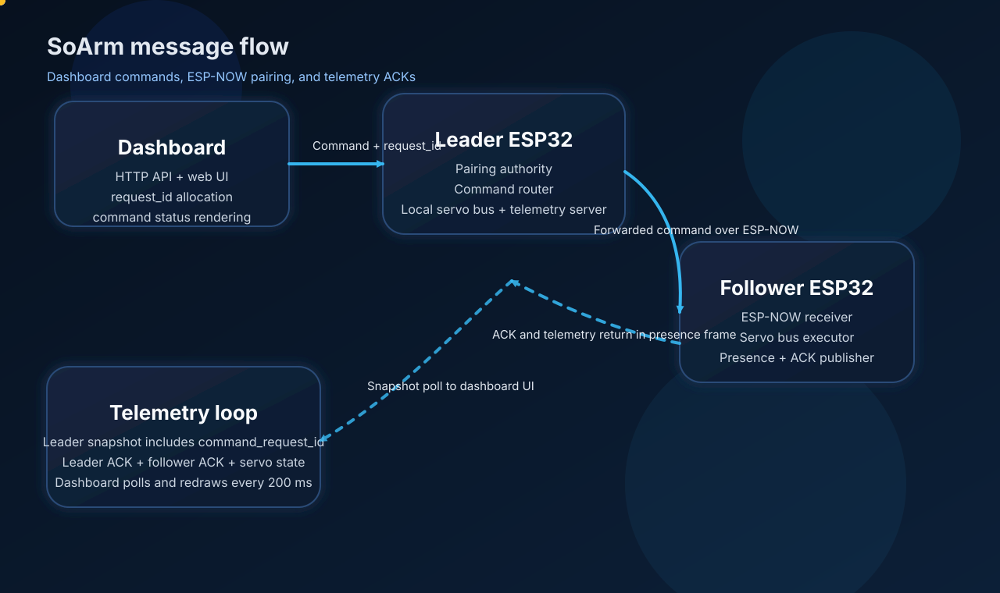

# System Architecture

This document describes the current runtime architecture of the SoArm ESP32 firmware, the telemetry dashboard, and the message flow between the two boards.

## Teleoperation performance

For mirroring cadence, transport choice (ESP-NOW vs Wi-Fi UDP), LeRobot alignment, and salon checklist, see [teleop_performance.md](../teleop_performance.md).

## Communication links (diagrams)

Actor-level diagrams (Mermaid + SVG) for LeRobot, ESP-NOW/Wi-Fi mirror, COM mirror bench, and the proposed USB-debug + direct ESP Wi-Fi architecture:

- [communication_links.md](./communication_links.md)
- [communication_links.svg](./communication_links.svg)
- [xbox_ble_controls.md](./xbox_ble_controls.md) — BLE manette, cycle de profils, boutons cal/OTA

## Refactor roadmap

Tracked checklist (profiles to remove, heartbeat manager, Wi-Fi AP/STA teleop, USB debug): [../REFACTORING_PLAN.md](../REFACTORING_PLAN.md)

## Overview

The project is split into three main runtime actors:

- Dashboard UI and Python bridge on the development machine
- Leader board, which owns the dashboard socket, pairing authority, and local servo bus
- Follower board, which executes mirrored servo commands and reports servo telemetry

The dashboard never talks directly to the follower. All commands go through the leader, which decides whether a command applies locally, should be forwarded to the follower, or should be rejected.

## Runtime Roles

### Dashboard

The dashboard is a local web UI served by the Python tooling in `ESP32/tools/telemetry_dashboard/`.

It does three jobs:

1. Sends commands to the leader command socket.
2. Polls the latest telemetry snapshot through the Python API.
3. Displays pairing state, command request IDs, ACK status, and servo telemetry for both boards.

### Leader Board

The leader board owns:

- ESP-NOW pairing authority
- the local servo bus
- the telemetry stream server on port `9090`
- request ID tracking for dashboard commands
- ACK tracking for forwarded follower commands

The leader is the routing point for the UI. It can:

- apply a command locally
- forward a command to the follower
- combine local and follower ACK state into the telemetry snapshot

### Follower Board

The follower board owns:

- the follower-side ESP-NOW presence link
- the follower servo bus
- the follower-side servo scan and command execution

The follower receives only the commands that the leader forwards over ESP-NOW. It also publishes servo telemetry and the current debug/manual flag back through the presence stream.

## Message Flow

The message flow is intentionally layered:

1. Dashboard sends a command with a request ID to the Python HTTP API.
2. Python forwards that command to the leader telemetry socket.
3. Leader command processing decodes the command and stores the request ID.
4. Leader applies local effects and optionally forwards the command to the follower over ESP-NOW.
5. Follower executes the command, records the ACK result, and publishes telemetry in the next presence frame.
6. Leader receives the follower presence frame and exposes the latest ACK status in the telemetry snapshot.
7. Dashboard polls the snapshot and renders the request ID, command code, and ACK state.

## Pairing Lifecycle

Pairing is handled by ESP-NOW presence messages.

Normal sequence:

1. Follower sends `PairRequest`.
2. Leader accepts the request if pairing is open or the MAC already matches the paired peer.
3. Leader sends `PairAck`.
4. Both boards persist the peer MAC in NVS.
5. The follower sends compact **LinkHeartbeat** frames when idle (~1 Hz) and full **Presence** less often (~5 s). While teleop batches flow, outbound presence is suppressed; any inbound frame resets link liveness on both boards (`LinkHeartbeatManager`).

Recovery sequence:

1. Dashboard sends `Reset Pairing`.
2. Leader clears its paired MAC and broadcasts `PairReset`.
3. Follower receives `PairReset`, clears its own pairing state, and resumes unpaired `PairRequest` messages.
4. Leader accepts the next valid `PairRequest` and re-establishes the link.

## Command Path

The current command path is request-ID based.

Command types sent from the dashboard include:

- pairing reset
- servo scan, with explicit target selection
- leader debug enable / disable
- follower debug enable / disable
- servo move
- servo ID change
- servo mode change

For each command, the dashboard API allocates a unique request ID. The leader stores that request ID in the telemetry snapshot and forwards it to the follower when relevant.

The follower returns a command ACK in the next compact heartbeat or full presence frame. The leader then exposes the latest follower ACK result alongside the local leader ACK result.

## Telemetry Path

The telemetry snapshot published by the leader contains:

- board uptime and CPU load
- leader and follower state machine status
- pairing status
- leader and follower MAC addresses
- leader and follower servo counts
- leader and follower detected servo IDs
- leader and follower servo telemetry strings
- last command request ID
- last command code
- leader command status
- follower command status

The dashboard renders that snapshot directly, so any change in the snapshot structure must be reflected in the Python protocol and the web UI.

## Relevant Files

- [ESP32/src/leader/leader_app.cpp](../../src/leader/leader_app.cpp)
- [ESP32/src/leader/leader_presence_service.cpp](../../src/leader/leader_presence_service.cpp)
- [ESP32/src/follower/follower_app.cpp](../../src/follower/follower_app.cpp)
- [ESP32/src/follower/follower_presence_service.cpp](../../src/follower/follower_presence_service.cpp)
- [ESP32/tools/telemetry_dashboard/dashboard_protocol.py](../../tools/telemetry_dashboard/dashboard_protocol.py)
- [ESP32/tools/telemetry_dashboard/dashboard_server.py](../../tools/telemetry_dashboard/dashboard_server.py)
- [ESP32/tools/telemetry_dashboard/static/index.html](../../tools/telemetry_dashboard/static/index.html)
- [ESP32/tools/telemetry_dashboard/static/app.js](../../tools/telemetry_dashboard/static/app.js)

## Diagram

