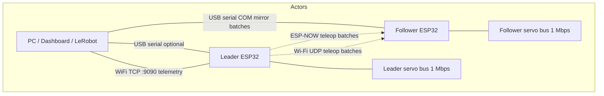
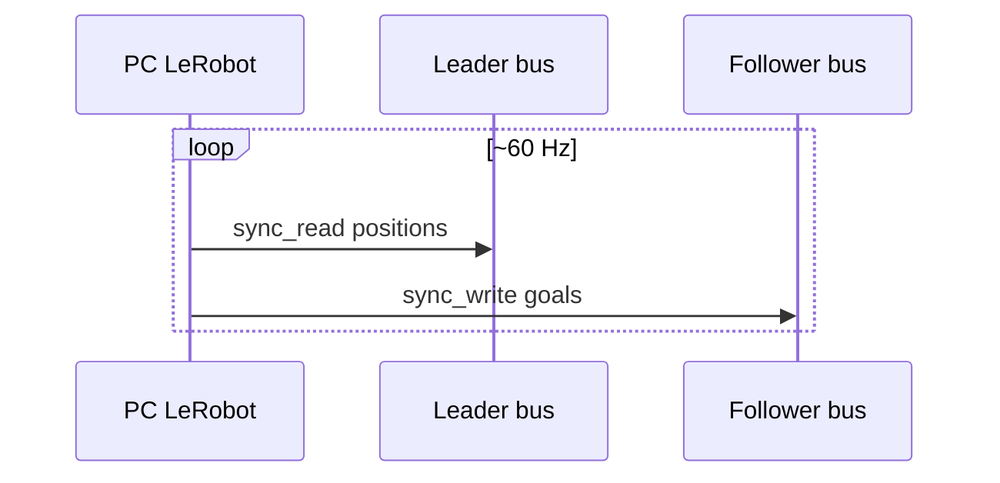
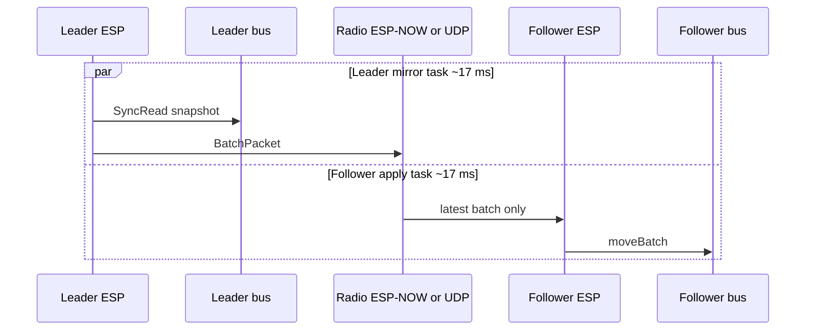
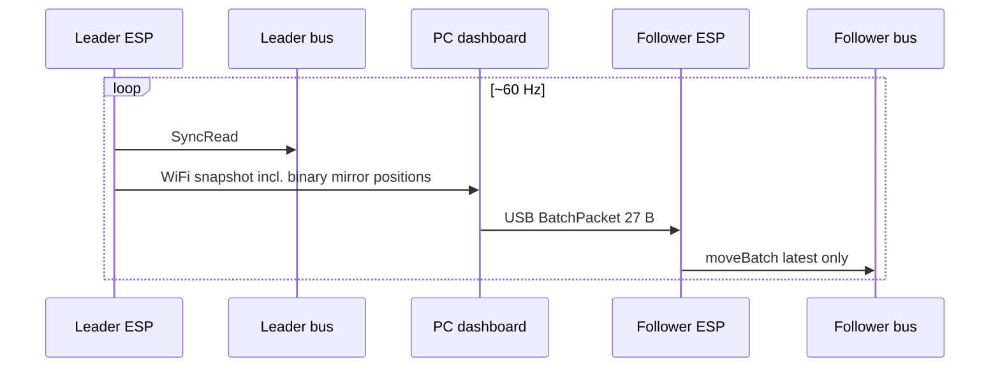
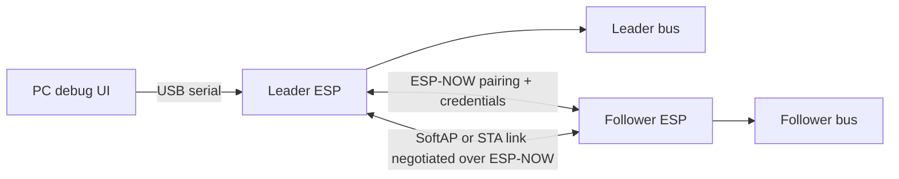

# Communication links between actors

This document maps how the PC dashboard, leader ESP32, follower ESP32, and servo buses interact in each operating mode.

For teleop tuning details see [teleop_performance.md](../teleop_performance.md).

## Actors

| Actor | Role |
|-------|------|
| **PC** | LeRobot, telemetry dashboard, COM mirror bridge |
| **Leader ESP** | Reads leader servos, Xbox, pairing, telemetry stream `:9090` |
| **Follower ESP** | Applies mirror batches, reads follower servos when idle |
| **Servo bus** | Half-duplex serial @ 1 Mbaud (STS3215 class) |

## Mode comparison (Mermaid)

### 1. LeRobot (PC synchronous loop)

**Bottleneck:** USB latency ×2 + two half-duplex bus transactions per cycle. Typical budget @ 60 Hz: ~17 ms total; bus reads/writes often ~3–8 ms each on 6 servos.

### 2. ESP-NOW / Wi-Fi mirror (current production path)

**Notes:**

- Leader runs **servo_poll** and **teleop_mirror** tasks; follower runs **teleop_apply** (move only) and pauses **bus telemetry publish** while teleop traffic is recent.
- Wi-Fi path can traverse home router; ESP-NOW is lower latency but shares radio with Wi-Fi stack.

### 3. COM mirror bench (profile `TeleopPcSerial` = 5)

**IHM load reduction:** leader telemetry snapshots to the dashboard are throttled to **250 ms** during this profile so the PC path is not flooded.

**Exit:** disable teleop continuous or change controller profile on the leader (Xbox / dashboard); stop COM mirror in the dashboard; follower resumes bus telemetry after `kTeleopTrafficRecentMs` (2.5 s) without batches.

### 4. Proposed future: USB debug + direct ESP-to-ESP Wi-Fi

**Intent:**

- **USB** only for debug / dashboard on the leader (no radio contention with teleop).
- **Radio** only between the two ESPs: keep ESP-NOW for pairing and AP password exchange; optional **soft-AP + STA** for higher throughput TCP/UDP mirroring without a home router.
- Follower forwards batches straight to `moveBatch` (same as today’s apply task).

This is a larger refactor (web UI connects via leader COM, transport state machine, security on negotiated WPA2).

## Throughput rough estimates

| Link | Typical practical throughput | Comment |
|------|------------------------------|---------|
| Servo bus @ 1 Mbaud | ~30–80 KB/s payload | Half-duplex; SyncRead 6 servos ~3–6 ms |
| USB CDC @ 115200 | ~11 KB/s | COM mirror @ 60 Hz × 27 B ≈ 1.6 KB/s OK |
| USB CDC @ 921600+ | ~90 KB/s | Headroom for binary streams |
| ESP-NOW | ~200–500 kbps effective | Shared with Wi-Fi; small batches fit 60 Hz |
| Wi-Fi UDP via router | 1–20+ Mbps | Often latency/jitter limited, not bandwidth |
| ESP soft-AP direct | Up to ~10–20 Mbps class | Depends on PHY; better than ESP-NOW for bulk |

**LeRobot-style PC loop @ 60 Hz:** budget ≈ 17 ms − (leader read + follower write + 2× USB). Feasible on fast USB and optimized sync IO; tight on 115200 COM mirror path because PC adds jitter.

**Leader + follower async buses:** leader read and follower write can overlap in time on separate boards; end-to-end latency ≈ leader read + radio + follower write (not sum of USB legs).

## OTA (ArduinoOTA over home Wi-Fi STA)

**How it works today**

1. At boot, firmware runs `WiFi.begin(SOARM_WIFI_SSID)` (credentials from build env) and `ArduinoOTA.begin()` with hostname `soarm-leader` or `soarm-follower`.
2. Every `tick()`, `ArduinoOTA.handle()` listens for the **espota** protocol (PlatformIO `upload_protocol = espota`, port 3232).
3. Your PC must be on the **same LAN**; upload target is `soarm-leader.local` or the board IP (`env:leader-ota` in `platformio.ini`).
4. There is **no separate “OTA mode” on the wire** — the board is flashed whenever it has an IP and OTA is not busy with teleop. Switching Xbox profile to **OtaReady** only forces `setStaConnectDesired(true)` so STA reconnects after TeleopEspNow.

**TeleopEspNow vs OTA**

- In **TeleopEspNow**, the dashboard TCP server (`:9090`) is paused; STA **stays connected** (calling `WiFi.disconnect()` with ESP-NOW + BLE active can reboot the chip). OTA from PC will **not** work reliably until you:
  - Cycle Xbox profile to **OtaReady** or **TeleopWifi** / calibration (STA on), wait for IP on OLED, then `pio run -e leader-ota -t upload`, **or**
  - Use **USB** upload: `pio run -e leader -t upload` (works even with no Wi-Fi).
- On OTA upload start, `ArduinoOTA.onStart` forces `WiFi.begin()` again if STA was off.

**Follower**

- No Xbox profile; STA drops only while ESP-NOW teleop is active. For follower OTA, stop teleop or power follower alone on Wi-Fi until connected.

**Serial monitor**

- Leader USB CDC default is **115200** (`USB_CDC_BAUD` in `env:leader`). Match `monitor_speed` / `pio device monitor -b 115200`. Use `env:leader-usb1m` for 1 Mbaud passthrough bench only.

**USB dashboard debug (Phase 3)**

- When `:9090` is paused (TeleopEspNow), run the dashboard on the leader COM port: see [xbox_ble_controls.md](./xbox_ble_controls.md).

## SVG diagram

See [communication_links.svg](./communication_links.svg) for a printable overview of all four paths.
