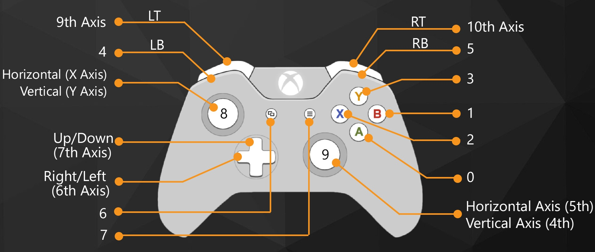

# Hardware

Reference setup for this firmware on **SO-ARM101** arms with **Feetech STS3215** bus servos (6 per arm -> see LeRobot documentation to get the proper vesions of the servo depending on the arm you are building: Leader or follower).

## Bill of materials (tested)

| Role | Board | Link | Notes |
|------|--------|------|--------|
| **Leader** | Waveshare **Servo Driver with ESP32** | [waveshare.com/servo-driver-with-esp32](https://www.waveshare.com/servo-driver-with-esp32.htm) | OLED, status LEDs, USB, servo bus, **Xbox BLE** target |
| **Follower** | Waveshare **Bus Servo Driver HAT (A)** | [waveshare.com/bus-servo-driver-hat-a](https://www.waveshare.com/bus-servo-driver-hat-a.htm) | Compact ESP32 + servo bus; no OLED UI in follower firmware |
| **Controller** | **Xbox Wireless Controller** (Bluetooth) | [Xbox Wireless Controller](https://www.xbox.com/accessories/controllers/xbox-wireless-controller) | Series X\|S / One S **Bluetooth** models |



Firmware uses **View (button 6)** as **Mode**, **A (0)**, **B (1)** only until IK teleop — see [calibration.md](calibration.md).
| **Servos** | Feetech **STS3215** (or compatible STS bus) | — | 1 Mbaud half-duplex bus per board |
| **Power** | Per Waveshare / arm kit | — | Separate supply for servos vs logic as per board manual |

### Follower board flexibility

Any **Waveshare ESP32 servo driver** that speaks the **STS serial bus** at **1 Mbps** can run the **follower** firmware. Examples:

- [Bus Servo Driver HAT (A)](https://www.waveshare.com/bus-servo-driver-hat-a.htm) (default in docs)
- [Servo Driver with ESP32](https://www.waveshare.com/servo-driver-with-esp32.htm) (same PCB as leader — **OLED is not used** on the follower build; status LEDs still work)

Pin defaults in firmware assume Waveshare wiring (`Serial2`, RX/TX pins in `platformio.ini` / board headers). Adjust only if your carrier board differs.

## Logical layout

```text
                    ┌─────────────────────────────┐
  Xbox (BLE) ──────►│  Leader — Servo Driver      │
                    │  ESP32 + OLED + STS bus ×6  │
                    └──────────────┬──────────────┘
                                   │ ESP-NOW or Wi-Fi teleop
                    ┌──────────────▼──────────────┐
                    │  Follower — Driver HAT (A)  │
                    │  ESP32 + STS bus ×6         │
                    └─────────────────────────────┘

  Optional (not required for salon teleop):
    travel router / phone hotspot  ──►  OTA + HTML dashboard
    laptop  ──►  Python dashboard → leader :9090
```

## Leader vs follower firmware

| | Leader | Follower |
|--|--------|----------|
| PlatformIO env | `leader` / `leader-ota` | `follower` / `follower-ota` |
| OLED menu | Yes | No (even if hardware has OLED) |
| Xbox BLE | Yes (`LEADER_ENABLE_XBOX_BLE`) | No |
| Telemetry TCP `:9090` | Yes | No |
| ESP-NOW pairing | Accepts / resets pairing | Sends `PairRequest` when unpaired |
| Calibration UI | Xbox + OLED workflow | Executed via ESP-NOW from leader |

Flash **both** boards after teleop protocol changes. See [ESP32/README.md](../README.md).

## Related docs

- [networking.md](networking.md) — router optional vs required, Wi-Fi credentials at build time
- [calibration.md](calibration.md) — per-arm ranges in NVS
- [xbox_ble_controls.md](architecture/xbox_ble_controls.md) — controller pairing and profiles
