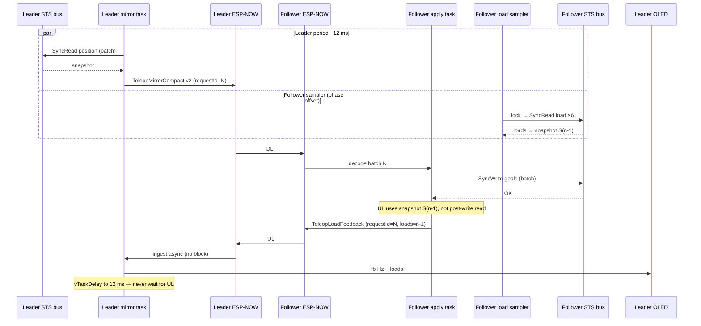
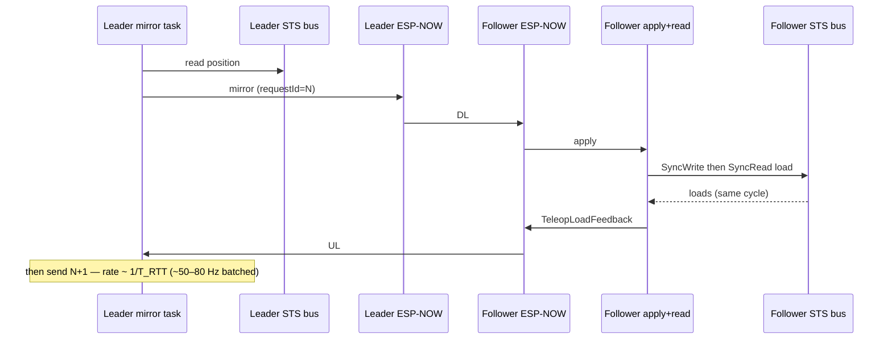
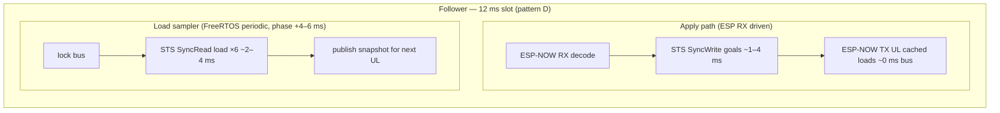

# ESP-NOW feedback teleop — architecture plan (Phase 5)

**Status:** design sign-off target before implementation.  
**Depends on:** stable **ESP-NOW Turbo** downlink ([teleop_espnow_turbo_codec.md](teleop_espnow_turbo_codec.md) phases 1 + B).  
**Menu / OLED:** [oled_menu.md](oled_menu.md) · **Refactor phases:** [oled_menu_refactor_plan.md](oled_menu_refactor_plan.md)

## Goal

Extend **turbo** teleop with a **compact load/torque uplink** from the follower (6 servos; gripper ID 6 highest priority on OLED). Phase **5.1** = display + **fb Hz** metric. Phase **5.2** = leader torque overlay / quasi–zero-G (hardware tuning).

---

## Ping-pong, piggyback, and pipelined load — which pattern?

### Why “25–50 Hz” was mentioned (and when it is wrong)

**Strict ping-pong** means the leader mirror task **does not send frame N+1 until** feedback for frame N is received. One full round-trip:

```text
T_RTT ≈ T_leader_STS_pos_read + T_ESP_DL + T_follower_STS_write + T_follower_STS_load_read + T_ESP_UL + T_leader_process
```

With **batched** `SyncWritePos` (6 goals, one transaction) and **batched** `syncRead` load (same machinery as position — `syncReadPacketTx` ×6, one RX pass), follower bus time is roughly **~3–7 ms** (write + read), not 12 ms of sequential per-servo chatter. Leader position read is similar (~2–4 ms). ESP-NOW DL+UL is often **~2–6 ms** depending on coexistence.

| Scenario | Typical T_RTT | Mirror Hz if leader blocks |
|----------|---------------|------------------------------|
| Batched STS + small ESP frames, good radio | **~10–14 ms** | **~70–100 Hz** |
| BLE + Wi-Fi coexistence, radio busy | **~18–30 ms** | **~33–55 Hz** |
| Worst case (retries, long I/O timeout) | **> 30 ms** | **< 33 Hz** |

The earlier **25–50 Hz** band was a **pessimistic** worst-case for “leader waits for UL every cycle”, not a limit of `SyncWrite`/`syncRead` batching. Batching does **not** remove the RTT bound if the leader **blocks** — it only shortens the STS portion.

**Separate boards, separate buses:** leader position read and follower load read **can** run in **parallel wall-clock time** (two UARTs). What you **cannot** do on the **follower** is write and read on the **same** bus at once — hence a bus lock and **phase offset** between apply and load sampler (see pattern **D** below).

### Pattern comparison

| Approach | Mirror Hz | fb Hz | Load freshness | Complexity | Best for |
|----------|-----------|-------|----------------|------------|----------|
| **A. Strict ping-pong** (leader blocks on UL) | RTT-bound (~50–80 Hz typical, worse with coexistence) | = mirror | ~1 RTT (~12–24 ms) | Medium | 5.2 haptic experiments |
| **B. Async mirror + sporadic UL** | **~83 Hz** | variable | stale | Low | not recommended |
| **C. Serial piggyback** (write → read → UL in apply task) | **~83 Hz** | **≤ ~50–70 Hz** if B+C+UL > 12 ms | ~1 apply after write | Low | simple fallback |
| **D. Pipelined sampler + autonomous UL** | **~83 Hz** | **~80 Hz** (DL idle OK) | **~12 ms** | Medium | **Recommended 5.1+** |

### Recommendation (KISS / YAGNI) — pattern **D**

1. **Phase 5.1 — pipelined load sampler + autonomous UL (pattern D).**  
   - Leader mirror task stays **periodic** (`kTeleopTurboControlPeriodMs`, 12 ms) — **never** block the loop on UL. Turbo downlink stays **sparse/adaptive** when the leader moves.  
   - Follower **apply task**: on mirror RX → `SyncWrite` only (no load UL piggyback).  
   - Follower **`TeleopLoadSamplerTask`** (~12 ms, phase-offset): `syncRead` present load (motion-filtered) → **ESP-NOW TX `TeleopLoadFeedback` directly** (~80 Hz), decoupled from mirror DL.  
   - `requestId` on load UL uses a follower-local sequence (`≥ 50000`), not the mirror batch id.  
   - Snapshot cache remains for diagnostics; haptic/OLED consume the autonomous UL stream.

2. **Phase 5.2 — optional soft sync for haptic.**  
   Short non-blocking wait (2–3 ms) for UL matching last `requestId`; on timeout, reuse EMA loads. Full strict ping-pong (A) remains opt-in for gripper-only tuning.

**Why D beats C:** pattern C serializes `write → read → send` on the follower bus inside the apply slot. If that exceeds ~8 ms, **fb Hz** drops while mirror stays 83 Hz. Pattern D overlaps load read with the **next** air slot: apply sends UL immediately using cached loads; sampler fills the cache for the **next** UL without blocking apply.

---

## Bottlenecks (honest)

### Follower STS bus (half-duplex UART)

**Pattern D** splits bus work across two tasks with one **`ScopedBusLock`** (same as position `syncRead` today):

```text
Apply task (on ESP RX):     SyncWritePos batch     →  ~1–4 ms
Load sampler (periodic):    SyncRead Load ×6       →  ~2–4 ms  (offset ~4–6 ms from apply)
```

Write and read **never overlap** on the wire; they **overlap in the 12 ms wall-clock slot** with leader TX/RX on a **different** board. Apply does **not** wait for load read before UL.

### ESP-NOW (one radio per ESP32)

Typical sequence on air (half-duplex friendly — UL after DL, small packets):

```text
Leader TX (turbo v2, 9–16 B)  →  Follower RX  →  apply + UL (cached loads)
Follower TX (load fb, ~10 B)    →  Leader RX    (async ingest)
```

Leader does **not** wait for UL before next DL. Stagger avoids same-board TX collision; follower UL uses **pre-read** snapshot so TX happens right after write (~1–4 ms after RX), not after another bus read.

### Leader STS bus

Independent from follower. Phase 5.1 only **displays** loads — no extra leader bus traffic. Phase 5.2 adds torque writes on the leader bus (separate concern).

---

## Architecture (SOLID / KISS)

Reuse turbo; add **one new vertical slice**, no change to v2 position codec.

```text
                    LEADER                              FOLLOWER
                    ------                              --------

 ITeleopEspNowBatchCodec (existing turbo v2)
 ITeleopLoadFeedbackCodec (new, small)
 IFeedbackMetrics (new: Hz, timeouts, EMA loads)

 LeaderTeleopMirrorTask          ── unchanged cadence in 5.1
 LeaderPresenceService           ── + ingest TeleopLoadFeedback
 FollowerTeleopApplyTask         ── SyncWrite only + UL with cached loads
 FollowerTeleopLoadSamplerTask   ── NEW: periodic syncRead load, atomic snapshot
 ServoBusService                 ── + syncReadPresentLoad(ids[])
 OledFeedbackTeleopRenderer      ── 4-line layout (loads + fb Hz)
```

| Principle | How |
|-----------|-----|
| **S** | Codec encodes bytes; apply task moves servos; feedback step reads load + sends; presence routes packets; OLED only renders. |
| **O** | Feedback mode = turbo transport + `IFeedbackCadencePolicy` (pipelined default; soft-wait in 5.2). |
| **L** | `TeleopEspNowTurboCompactCodec` untouched; new message type, not a v3 position frame. |
| **I** | `ITeleopLoadFeedbackCodec`, `IFeedbackMetricsSink` (leader metrics / OLED). |
| **D** | Inject feedback hook from `FollowerApp` into apply task; no copy-paste of turbo session logic. |
| **KISS** | One uplink packet type; correlate with existing `requestId`. |
| **DRY** | Reuse `ServoBusService` sync_read pattern (new register constant for load). |
| **YAGNI** | No leader blocking wait in 5.1; no 0G torque until 5.1 bench is green. |

---

## Wire format (13 bytes)

`PresenceMessageType::TeleopLoadFeedback = 13`

```text
Offset  Field
0       magic (0xA5)
1       wireVersion = 1
2       messageType = 13
3..4    requestId (uint16 LE) — autonomous UL sequence (≥50000)
5..10   load[6] (uint8, 0..127 — STS |Present Load| / 8, motion-filtered on follower)
11..12  gripperPresentPos (uint16 LE) — follower J6 STS present position for haptic sync
```

Follower load sampler reads speed + load + moving in one sync block. Load is **zeroed** when `MOVING≠0` or `|speed|>80` so mirror chase spikes are not uplinked. STS load sign uses **bit 10** (per SCServo `ReadLoad`), not bit 15.

---

## OLED layout (feedback teleop active)

| Line | Content |
|------|---------|
| 0 | `J1:xx J2:xx J3:xx` (loads 1–3) |
| 1 | `J4:xx J5:xx J6:xx` (loads 4–6) |
| 2 | `fb:42Hz lat:7ms` — **feedback rate** + optional mirror latency |
| 3 | `GRIP:xxx` — servo **6** emphasized |

**fb Hz:** EWMA of feedback packets received per second on the leader (`IFeedbackMetrics`). Essential to see whether optimization helps.

---

## Message flow — vertical timeline (one 12 ms slot)

Pattern **D — pipelined sampler + n−1 piggyback** (recommended 5.1):



Strict **ping-pong** (optional 5.2 — leader blocks before N+1):



---

## Bus occupancy diagram (follower, one 12 ms slot)

Pattern **D** — apply and sampler **interleave** on the bus; UL does not wait for read:



**Lock rule:** sampler and apply both use `ScopedBusLock`; if apply holds lock during write, sampler skips or retries next period (missed sample → reuse last snapshot, increment `samplerSkip` metric).

Pattern **C** (fallback) — serial chain limits fb Hz:

```text
RX → Write → Read load → UL → idle   (B+C may exceed slot)
```

---

## Leader mirror loop — what changes in 5.1

| Today (turbo) | Feedback 5.1 |
|---------------|----------------|
| `vTaskDelay` to pad 12 ms period | **Same** — do not block on UL |
| `processFollowerBatchAck` (ServoCommandAck) | Keep or slim; load UL is **separate** message |
| OLED `lat` / `dr` | Add `fb` Hz + load lines |
| `TeleopTransportMode::EspNowTurbo` | New `EspNowFeedback` extends turbo codec path |

**Timeout handling (your idea, adapted):**  
If no `TeleopLoadFeedback` for `requestId` within e.g. **40 ms**, increment `feedbackTimeoutCount`, **keep mirroring** with last EMA loads on OLED. Do **not** stop position stream. Optionally **re-send** last goals only if mirror ACK path already does that for loss — mirror stream is already continuous.

---

## Implementation phases

### 5.1 — Uplink + OLED + fb Hz (YAGNI scope)

| Step | Task | Files (indicative) |
|------|------|------------------|
| 1 | `ControllerOperationProfile::TeleopEspNowFeedback`, menu leaf, profile mapping | `controller_operation_profile.h`, `oled_menu_teleop_items.h`, … |
| 2 | `PresenceMessageType::TeleopLoadFeedback` + codec + native tests | `teleop_load_feedback_codec.*`, `presence_message_type.h` |
| 3 | `ServoBusService::syncReadPresentLoad(ids, out[6])` — same `syncReadPacketTx/Rx` as position | `servo_bus_service_sync_read.cpp` |
| 4 | Follower: `TeleopLoadSamplerTask` (~12 ms, phase offset) + atomic `FollowerLoadSnapshot` | `follower_teleop_load_sampler_task.*` |
| 5 | Follower apply: after `SyncWrite`, TX `TeleopLoadFeedback` with **cached** snapshot + `requestId` | `follower_app_teleop.cpp`, `follower_presence_transport.cpp` |
| 6 | Leader: ingest + `FeedbackMetrics` (Hz, timeouts, EMA, sampler skip) | `leader_presence_service_handlers.cpp`, `leader_teleop_feedback_metrics.*` |
| 7 | OLED renderer for feedback teleop | `leader_app_oled.cpp` or dedicated renderer |
| 8 | Bench: turbo `dr` still 0; `fb` ≥ ~70 Hz typical; document STS register scale | bench section below |

### 5.2 — Leader haptic / quasi–zero-G

| Step | Task | Status |
|------|------|--------|
| 9 | Map `loads[6]` → leader `TORQUE_LIMIT` (gripper gain 3/2) | done |
| 10 | Optional soft-wait for matching `requestId` | deferred |
| 11 | Release-detection: torque off when leader joint moves (`delta ≥ 3`) | done |
| 12 | Tunables in `leader_runtime_config.h` (`kTeleopHapticPeriodMs`, …) | done |
| 13 | Salon fluency + no oscillation on release | bench on hardware |

**Behaviour (current bench — see [teleop_haptic_handoff.md](teleop_haptic_handoff.md)):** gripper-only haptic on the leader. Contact detection uses **firm follower load + leader/follower position gap + engage streak**; position sync only when load ≥ `kTeleopHapticPositionSyncMinWireLoad`. Joints 1–5 stay torque-off. Tune limits in `leader_runtime_config.h`, `teleop_haptic_mapper.h`, and `teleop_haptic_contact.*`.

---

## Performance targets (bench)

| Metric | Target (5.1) | Notes |
|--------|----------------|-------|
| Mirror loop | ~83 Hz (`loopEwma` ~12 ms) | Same as turbo |
| `dr` (mirror) | 0 | No regression |
| `fb` (feedback) | **≥ 70 Hz** typical with pattern D; **≥ 30 Hz** min | Serial pattern C fallback if sampler starved |
| Load → OLED | **12–24 ms** (n−1 pipeline) — acceptable | EMA on leader display |
| UL airtime | ≤ ~12 B per apply | Keep ESP-NOW sparse |

---

## Risks

| Risk | Mitigation |
|------|------------|
| Bus lock contention (apply vs sampler) | Phase offset ~4–6 ms; skip sample metric; reuse last snapshot |
| ESP-NOW UL collides with DL | UL immediately after write (no post-write read); tiny frame; defer if radio busy |
| n−1 load mismatch on fast moves | Acceptable for 5.1 display; 5.2 haptic uses EMA + optional soft-wait |
| Noisy load values | EMA on follower before encode; deadband on display |
| Phase 5.2 fighting operator | Cap torque; disable overlay when leader moving |
| Strict ping-pong kills fluency | Default **pipelined D**; ping-pong opt-in for 5.2 |

---

## Acceptance criteria

### 5.1

- [x] Menu activates feedback teleop; turbo downlink codec unchanged.
- [x] **Pipelined** `TeleopLoadSamplerTask` + **autonomous** `TeleopLoadFeedback` UL (~80 Hz, decoupled from turbo DL).
- [x] OLED: 6 loads + **`fb:xxHz`** + emphasized gripper line.
- [x] Leader mirror loop **still** uses period delay, not blocking wait.
- [x] Native codec tests pass.

### 5.2

- [x] Gripper-weighted torque overlay on leader (`teleop_haptic_mapper`, `applyTeleopHapticOverlay`).
- [x] Leader motion releases torque per joint (mirror-friendly).
- [ ] Optional soft-wait policy behind config flag.
- [ ] Quasi–zero-G feel validated on hardware (tune limits).

---

## Related

- [teleop_espnow_turbo_codec.md](teleop_espnow_turbo_codec.md) — turbo v2 downlink
- [teleop_radio_fluency.md](teleop_radio_fluency.md) — radio checklist
- [teleop_haptic_handoff.md](teleop_haptic_handoff.md) — **resume guide** for Phase 5.2 haptic bench (status, tunables, open issues)
