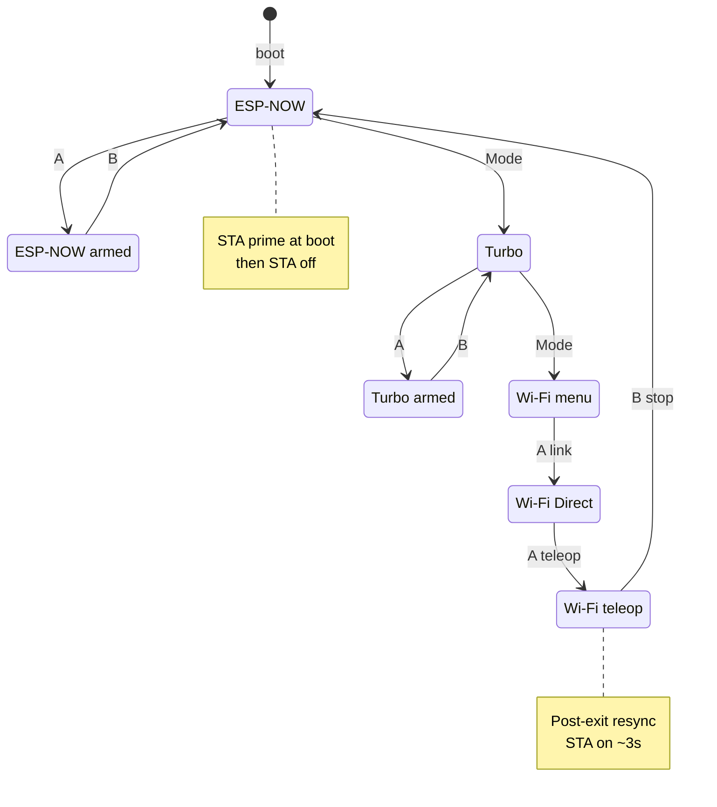
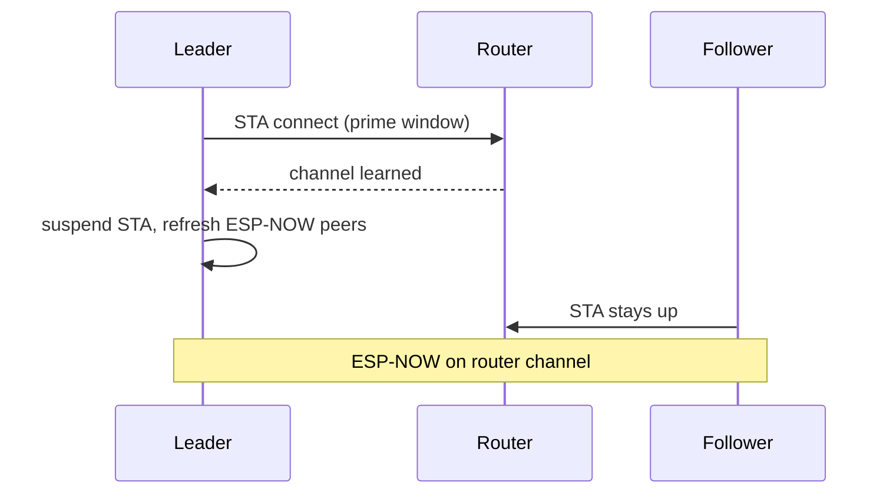
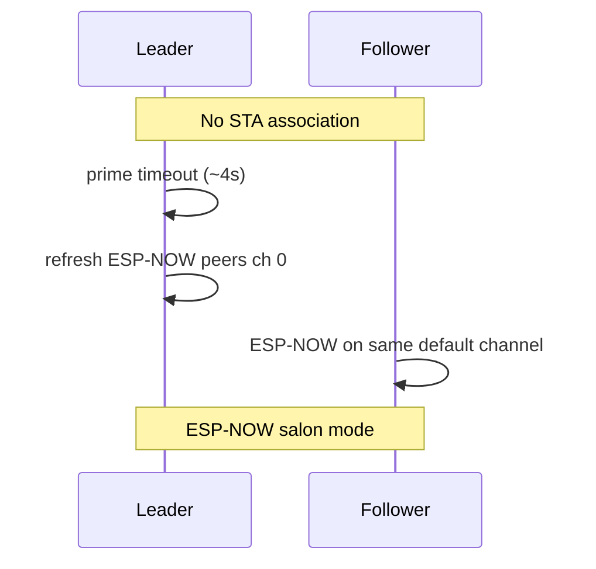
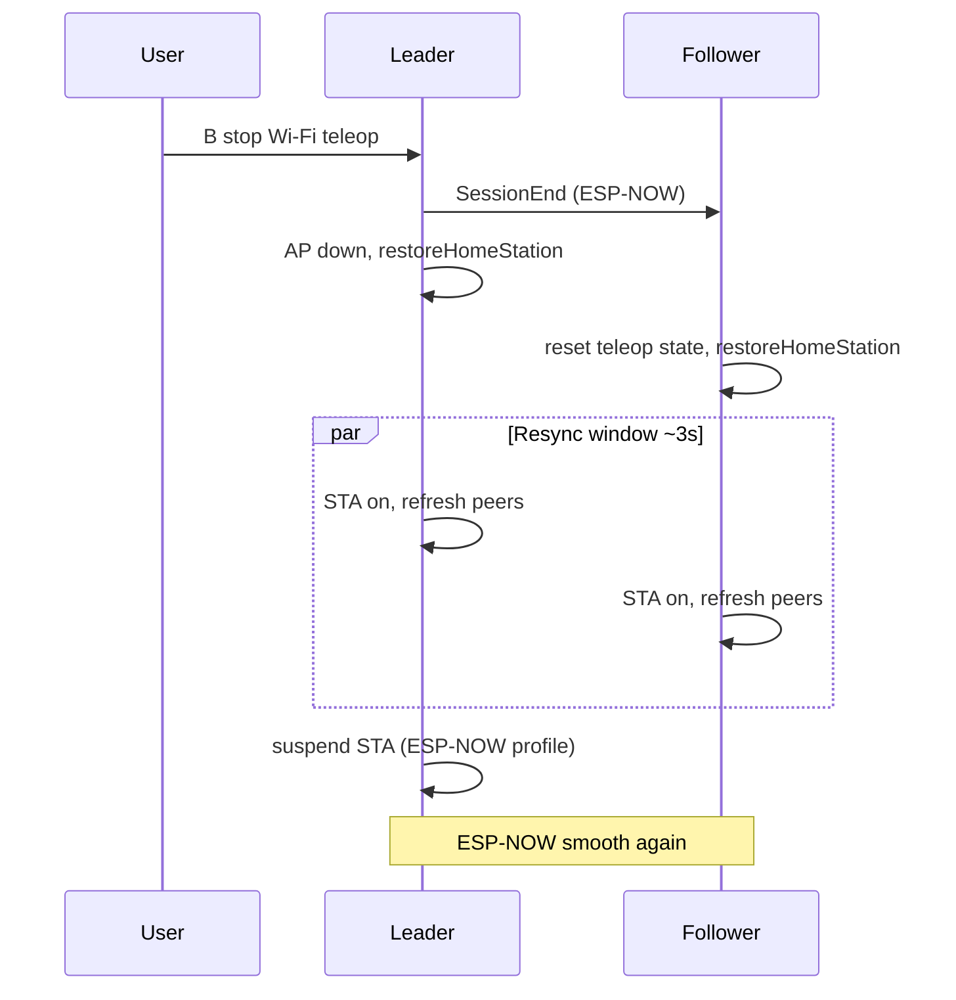

# Teleop Fluency & Radio State

This document explains how the firmware keeps leader–follower mirroring **smooth across operating profiles and profile transitions** — including cold boot, ESP-NOW ↔ turbo ↔ Wi-Fi Direct, and return to ESP-NOW.

For codec details see [teleop_espnow_turbo_codec.md](teleop_espnow_turbo_codec.md).  
For cadence and LeRobot bus alignment see [teleop_performance.md](teleop_performance.md).

## Design pillars

| Pillar | Problem it solves | Where |
|--------|-------------------|--------|
| **Wi-Fi channel priming** | Leader suspended home STA before learning the router channel → ESP-NOW mismatch; **without router**, prime times out and peers refresh on default channel | `LeaderApp::updateEspNowStaPrime`, [networking.md](networking.md) |
| **Post–Wi-Fi Direct resync** | Soft-AP left radio in `WIFI_AP_STA` with pinned ESP-NOW peers → subtle jitter after Wi-Fi teleop | `disengageWifiDirectLink`, `kPostWifiDirectEspNowResyncTimeoutMs` |
| **Dynamic ESP-NOW peers** | Peers pinned to a fixed channel during Wi-Fi Direct must be recreated as channel `0` (follow current radio) | `EspNowPresenceBase::addPeer` |
| **Fast bus read in mirror loop** | Stale telemetry snapshot caused repeated goals then jumps (especially turbo) | `leader_teleop_mirror_task.cpp` |
| **No discovery scan during teleop** | Full servo bus scan blocked mirror frames at teleop start | `leader_servo_telemetry_task.cpp` |
| **Teleop-start radio prep** | Peers and turbo session must be fresh when mirror arms | `prepareEspNowTeleopMirrorStart` on **A** |
| **Deferred boot ESP-NOW resync** | Second peer refresh after network stage (~3.2 s) | `leader_app_boot.cpp` |
| **Follower teleop state reset** | Queues / turbo decode session / activity timestamps after Wi-Fi session end | `resetTeleopTransportState` |
| **Link heartbeat vs teleop airtime** | Follower does not spam full presence at 60–83 Hz during mirror | `LinkHeartbeatManager` |

## Operating profiles (Xbox Mode cycle)

Default after boot: **TeleopEspNow** (profile 2).

| # | Profile | Teleop transport | Confirm with **A** |
|---|---------|------------------|----------------------|
| 0 | CalibrationLeader | — | Starts leader calibration |
| 1 | CalibrationFollower | — | Starts follower calibration |
| 2 | **TeleopEspNow** | ESP-NOW legacy batch (~83 Hz) | Starts mirror |
| 3 | **TeleopEspNowTurbo** | ESP-NOW compact v2 sparse/keyframe | Starts mirror |
| 4 | **TeleopWifi** | Wi-Fi UDP (after Direct link) | **A** = AP up, **A** again = teleop |
| 5 | Passthrough | USB ↔ servo bus bridge | Engages passthrough |
| 6 | OtaReady | — | Starts OTA window |

Cycling **Mode** only changes the *selected* profile. Calibration, Wi-Fi Direct, passthrough, and OTA require **A** (or dashboard commands).

## Profile & teleop status (state machine)

Narrow diagram — preview profiles vs armed teleop:



## Radio state by profile

Both boards share one 2.4 GHz radio (Wi-Fi + ESP-NOW; leader also uses BLE for Xbox).

### Leader

| Situation | `WiFi.mode` | Home STA (router) | Soft-AP | ESP-NOW | Dashboard `:9090` |
|-----------|-------------|-------------------|---------|---------|-------------------|
| Cold boot, ESP-NOW profile, **channel prime** | `STA` | **ON** (up to 4 s) if SSID configured; else off | off | on, peers ch `0` | on |
| ESP-NOW / turbo profile, idle | `STA` | **OFF** (suspended) | off | on | **paused** |
| ESP-NOW / turbo **mirror active** | `STA` | OFF | off | on, teleop batches | paused |
| Wi-Fi menu, link **not** engaged | `STA` | **ON** (OLED shows IP) | off | on | on |
| Wi-Fi Direct **link engaged** | `AP_STA` | OFF | **ON** (same ch as router when possible) | on, offer/ack pinned ch | on |
| Wi-Fi **teleop active** | `AP_STA` | OFF | ON | idle for mirror path | on |
| **After Wi-Fi Direct exit** | `STA` | **ON** (resync ≤3 s) | off | peers refreshed | per profile |
| OTA / calibration / passthrough **preview** | `STA` | **ON** | off | on | on |

### Follower

| Situation | Home STA | Wi-Fi Direct STA | ESP-NOW RX/TX |
|-----------|----------|------------------|---------------|
| Idle, paired | **ON** if SSID configured | off | presence + heartbeat |
| Idle, **no SSID** / router-less | off | off | presence + heartbeat |
| ESP-NOW teleop active | OFF (while batches recent) | off | mirror batches only |
| Wi-Fi Direct join | OFF | **ON** (leader AP) | offer/ack |
| Wi-Fi teleop active | OFF | ON | minimal |
| **Session end** from leader | **ON** (resync ≤3 s) | off | peers refreshed, teleop state cleared |

## Channel priming (cold boot)

ESP-NOW requires leader and follower on the **same Wi-Fi channel**.

### With a home router (SSID configured, AP on)

The follower usually stays associated on the **router channel**. The leader opens a short **prime window** (≤4 s): home STA **on**, learns the channel, then suspends STA for ESP-NOW teleop profiles.



### Without a router (router-less salon)

Teleop **does not require** a router. If `SOARM_WIFI_SSID` was **not** set at build time (or STA never associates), neither board joins an AP. After the prime **timeout**, firmware still marks channel learning complete and refreshes ESP-NOW peers on the **current radio channel** — typically aligned when both boards are unassociated.



See [networking.md](networking.md) for credentials, OTA, and when a router is optional vs useful.

**Triggers completion (both cases):** STA connected to router, **or** `kHomeWifiChannelPrimeTimeoutMs` (4 s).  
**Then:** `ensureEspNowTransportReady(0)`, `resetTurboTeleopSession`, STA suspend for ESP-NOW profiles (if SSID was configured).

## Post–Wi-Fi Direct resync

Activating Wi-Fi teleop (not just opening the Wi-Fi menu) puts the leader in `AP_STA` and may pin ESP-NOW peers to the soft-AP channel. Exiting must restore the same radio state as a healthy cold boot.



**Leader:** `espNowResyncAfterWifiDirectPending_` keeps STA up until connected or timeout.  
**Follower:** `espNowResyncAfterWifiDirectPending_` + `resetTeleopTransportState()` on session end.

## Motion pipeline (all ESP-NOW modes)

```text
Leader: refreshKnownTelemetryFast → snapshot → calibration remap → batch
        → codec (legacy 172 B or turbo v2 9–16 B) → esp_now_send
Follower: ingest → teleop apply task (~12 ms) → SyncWritePosEx batch
```

| Check | Classic ESP-NOW | Turbo |
|-------|-----------------|-------|
| Mirror bus read | Fast per frame | Fast per frame |
| Min position delta | 1 | 2 |
| Wire size | 172 B | 9–16 B typical |
| Session state | — | encode/decode session, keyframes |

## Transitions that refresh radio / teleop

| Transition | Actions |
|------------|---------|
| Boot → network stage | `syncWifiRadioPolicy`, deferred resync ~3.2 s |
| Any → ESP-NOW profile (Mode cycle) | `syncWifiRadioPolicy`, suspend STA if channel learned |
| **A** start ESP-NOW mirror | `prepareEspNowTeleopMirrorStart` |
| Leave ESP-NOW profile | `releaseFollowerTeleopHold` (DebugDisable to follower) |
| Wi-Fi Direct disengage | Session end, `restoreHomeStation`, post-wifi resync |
| OTA / calibration preview | Home STA **on** (helps channel alignment if user tours menus) |

## Key source files

| Area | Files |
|------|--------|
| Channel prime & Wi-Fi policy | `src/leader/leader_app_wifi_policy.cpp` |
| Teleop arm / release | `src/leader/leader_app_teleop_release.cpp` |
| Profile cycle | `src/leader/leader_app_controller_profile.cpp` |
| Mirror loop | `src/leader/leader_teleop_mirror_task.cpp` |
| ESP-NOW peers | `src/common/presence/espnow_presence_base.cpp` |
| Follower Wi-Fi policy | `src/follower/follower_app_wifi_policy.cpp` |
| Timeouts | `src/Config/leader_runtime_config.h`, `follower_runtime_config.h` |

## Validation checklist

1. **Cold boot** → ESP-NOW and turbo: smooth slow axis moves, leader OLED `connecting` (no router IP) after prime.
2. **Wi-Fi menu only** (no **A**): leader gets IP; return ESP-NOW still smooth.
3. **Wi-Fi teleop** run then **B** stop: brief leader IP during resync; ESP-NOW and turbo smooth again.
4. **Turbo OLED:** `lat` single digits ms, `dr` 0 during good link.
